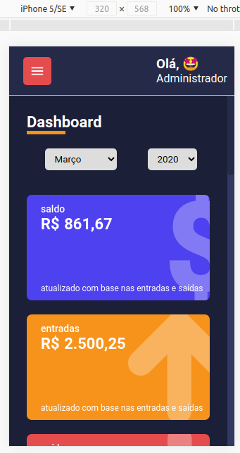

   Finanças

 

Protótipo JavaScript utilizando NodeJS  **ReactJs**, **TypeScript**, estilos com **styled-components**. Foram criados alguns **componentes puros** para melhor estruturação do projeto.
 

  

Os dados são armazenados em arrays para simular um banco de dados. É possível trabalhar com diversos banco de dados. Esta versão demonstração não trabalha com banco de dados, mas a versão 1.0 estará ajustada para trabalhar com MySQL.
 
 

### Layout & Componentes Responsivos

  Browser 1880x733 
  
   
  
   
  
   

### Detalhes
- [x] Projeto elaborado pelo instrutor Rodrigo Gonçalves Santana - 2020
- [x] Refeito por Maurício Fernandes da Rocha com pequenas alterações
- [x] Utilização da bibliteca opensource [**Recharts**](http://recharts.org/en-US) para a apresentação dos gráficos
- [x] Utilização do componente [**React CountUp**](https://www.npmjs.com/package/react-countup) para mostrar o efeito dos números crescendo no Dashboard

### Próxima versão
- [ ] Migrar para NextJS
- [ ] Incluir Banco de Dados MySQL
- [ ] Criar lançamentos

  <small>Maurício Fernandes da Rocha - 2021</small>

